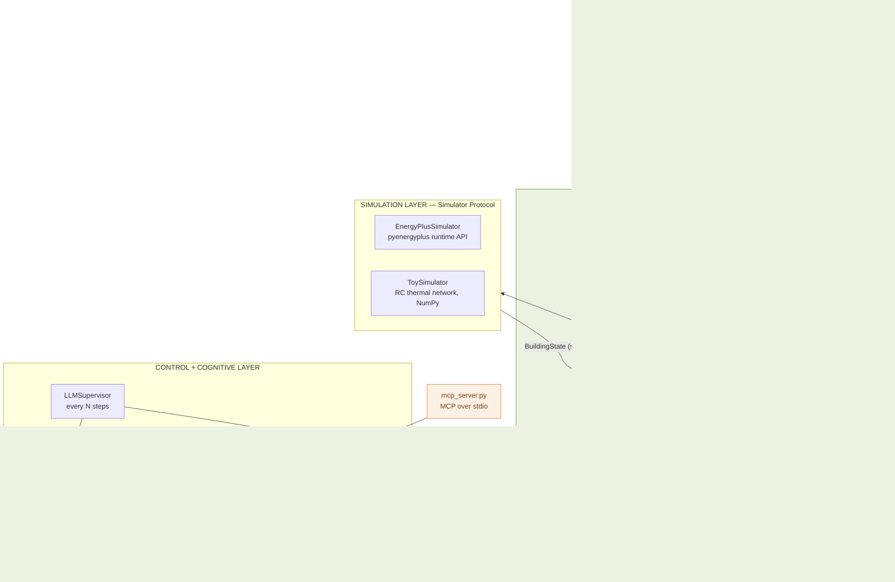
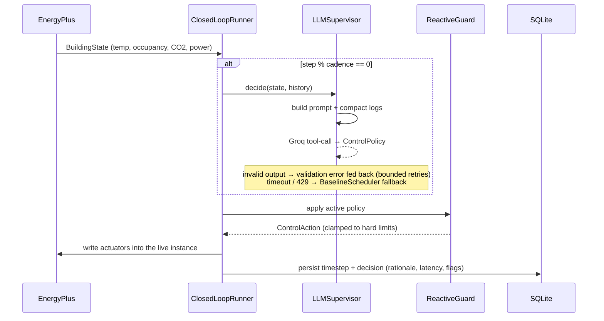
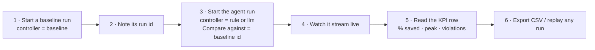
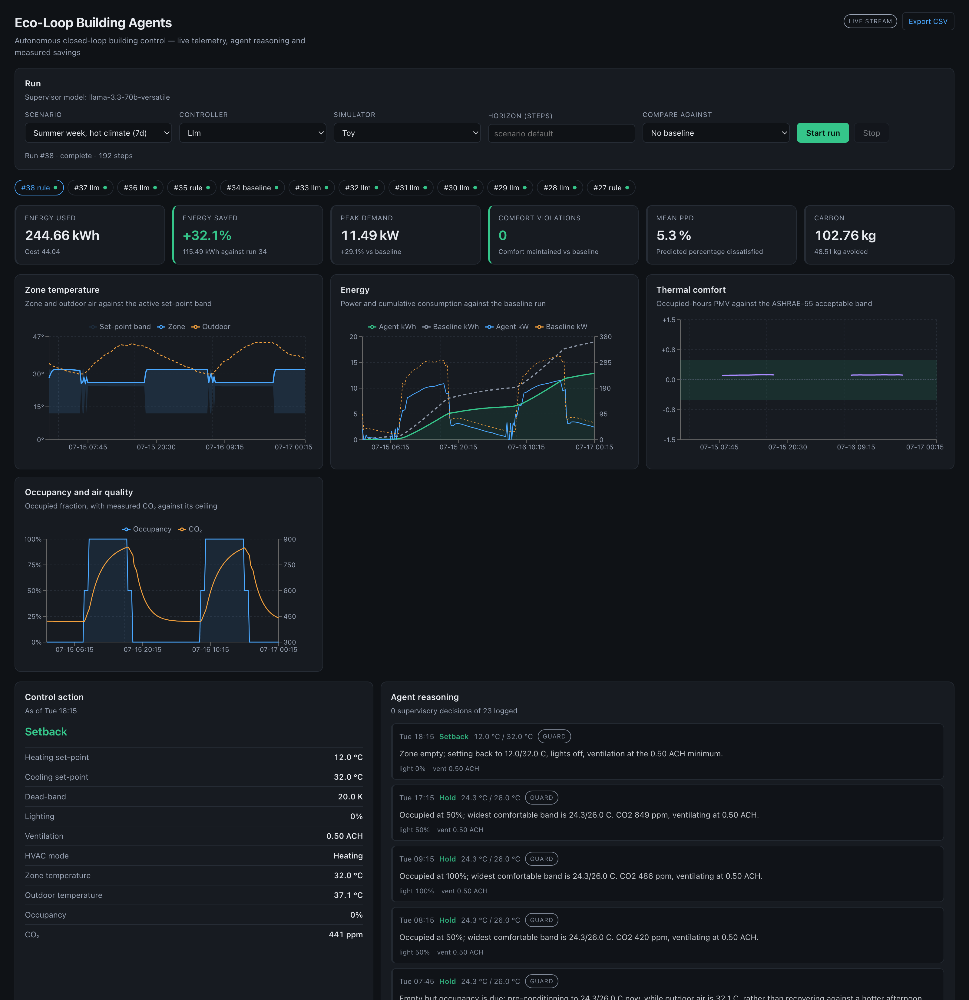
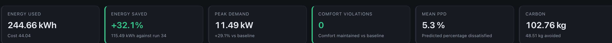
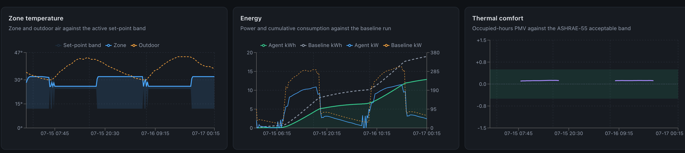
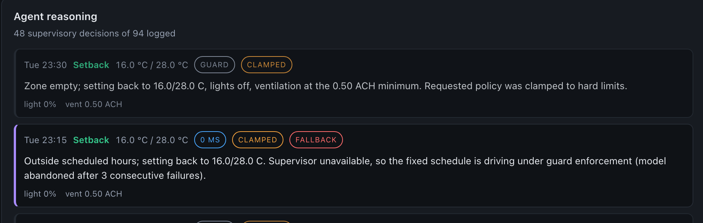
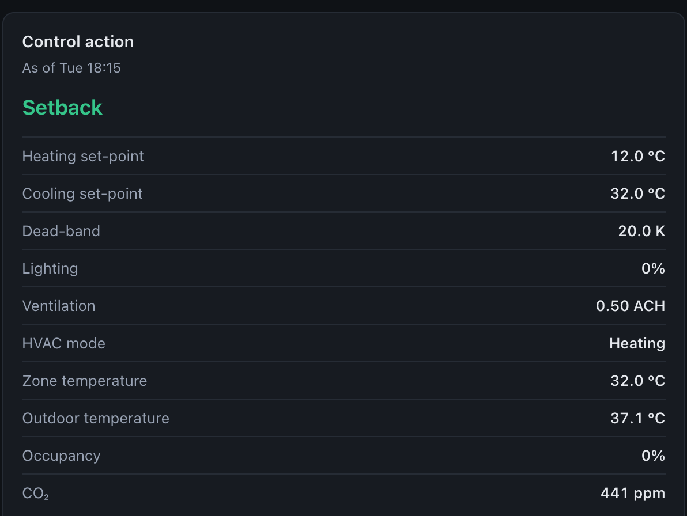

<div align="center">

# 🏢 Eco-Loop Building Agents

**An open-source LLM closes the control loop on a live EnergyPlus simulation — and proves the savings.**

[](https://www.python.org/)
[](https://fastapi.tiangolo.com/)
[](https://react.dev/)
[](https://energyplus.net/)
[](https://console.groq.com/)
[](https://modelcontextprotocol.io/)
[](#-testing)

*Honeywell Hackathon · Question 1 — Autonomous Closed-Loop Building Control*

</div>

---

## Overview

Buildings consume roughly **40 % of global energy**. Most are still run by building
management systems that follow a fixed clock: the same set-points every weekday,
regardless of weather, occupancy or grid carbon intensity. They are *reactive* —
comfort is corrected only after the occupants complain.

**Eco-Loop closes the loop.** A physics engine simulates a real building, an
open-source LLM reasons over its live telemetry against comfort, energy, tariff
and carbon targets, and the resulting set-points are injected back into the
*running* simulation through EnergyPlus actuators — no file rewriting, no restart.

```
EnergyPlus ──► sensor telemetry ──► LLM agent ──► control policy
     ▲                                                  │
     └──────────── set-point injection ◄────────────────┘
                     (live, in-process)

          baseline run  vs  agent run  ──►  % kWh saved
```

### The key innovation: two-tier control

An LLM call costs hundreds of milliseconds. An annual simulation at 15-minute
steps has **35,040 timesteps**. Putting a model on that path is impossible, and
letting one write set-points directly is unsafe.

| Tier | Runs | Cost | Responsibility |
|---|---|---|---|
| **Reactive Guard** (`agents/rule.py`) | every timestep | microseconds | Enforces the active policy, clamps every action to hard comfort and equipment limits |
| **LLM Supervisor** (`agents/llm.py`) | every *N* timesteps | seconds | Chooses the policy: set-point targets, pre-cool/setback strategy, lighting, ventilation |

The LLM sets **policy**; the guard **enforces** it and may override it. A
hallucinated set-point therefore cannot reach the building, and a slow or failed
model never stalls the run.

> [!NOTE]
> **Baseline and agent runs execute the identical code path**, with identical
> weather and occupancy — only the `Controller` differs. The savings figure is a
> controlled experiment, not a comparison of two different programs.

---

## ✨ Features

| | Feature | What it means |
|---|---|---|

| ✅ | **EnergyPlus integration** | Driven through the `pyenergyplus` runtime API — sensors read and actuators written *inside* the running simulation |
| ✅ | **AI-powered control** | Open-weight Llama 3.3 70B (via Groq) with native tool-calling emits a validated `ControlPolicy` |
| ✅ | **Reactive safety layer** | A deterministic guard clamps every action to hard comfort/equipment limits, every timestep |
| ✅ | **Explainable decisions** | Every decision persists its rationale, tool calls, latency, retries, fallback and clamp flags |
| ✅ | **MCP support** | The agent's own `ToolRegistry` served over stdio — six tools, identical in-process and externally |
| ✅ | **Live dashboard** | Eight React panels streaming telemetry, comfort, energy and agent reasoning over SSE |
| ✅ | **Dependency-free fallback** | A NumPy RC thermal-network `ToySimulator` behind the same `Protocol` — runs with no EnergyPlus install |
| ✅ | **Graceful degradation** | Retries → circuit breaker → baseline fallback under the guard; a model outage never aborts a run |
| ✅ | **Evidence store** | SQLite: runs · timesteps · decisions, with CSV export per run |
| ✅ | **392 automated tests** | 161 backend (pytest) + 231 frontend (vitest) |

---


## 🏗 Architecture



### One timestep, end to end



---

## 🧰 Technology Stack

| Layer | Technology | Why |
|---|---|---|
| Simulation | **EnergyPlus** + `pyenergyplus` runtime API | High-fidelity physics; actuators writable mid-run |
| Fallback simulation | **NumPy** RC thermal network (`ToySimulator`) | Same `Protocol`, zero external dependencies |
| LLM | **Groq** serving **Llama 3.3 70B** (`llama-3.3-70b-versatile`) | Open weights, native tool-calling, low latency |
| LLM transport | Official **`groq`** Python SDK | One transport; any Groq catalogue model by name |
| Agent protocol | **MCP** (`mcp>=1.0`) | Same tools exposed to external MCP clients |
| Backend | **Python 3.10+**, **FastAPI**, **Uvicorn**, **Pydantic v2** | Typed HTTP boundary, background runs |
| Streaming | **sse-starlette** | Live telemetry to the dashboard |
| Persistence | **SQLite** (WAL mode) | Single file, concurrent read while writing |
| Frontend | **React 18**, **Vite 5**, **Recharts 2** | Fast dev loop, declarative charts |
| Config | **python-dotenv** | Everything machine-specific in `.env` |
| Testing | **pytest**, **Vitest**, **Testing Library**, **jsdom** | 392 tests |
| Comfort model | Fanger **PMV / PPD** (ISO 7730, ASHRAE 55) | Implemented in `app/comfort.py` |

---

## 📁 Repository Structure

```
honeywell/
├── README.md                     this file
├── requirements.txt              backend Python dependencies
├── .env.example                  environment template — copy to .env
│
├── docs/
│   ├── ARCHITECTURE.md           full design document (15 sections, D1–D11)
│   ├── assets/                   dashboard screenshots
│   └── template/                 pristine copy of the submission PPT template
│
├── scripts/
│   └── build_presentation.py     populates the submission deck from repo facts
│
├── backend/
│   ├── cli.py                    headless entrypoint — run a scenario, print savings
│   ├── ecoloop.db                SQLite store (auto-created on first connect)
│   │
│   ├── app/
│   │   ├── main.py               FastAPI app: routes, run lifecycle, SSE
│   │   ├── config.py             Settings from env + scenario loader
│   │   ├── schemas.py            Pydantic request/response contracts
│   │   ├── db.py                 SQLite schema + every SQL statement in the project
│   │   ├── loop.py               ClosedLoopRunner — the closed loop itself
│   │   ├── comfort.py            Fanger PMV / PPD, comfort-band evaluation
│   │   ├── energy.py             kWh, cost, CO2, baseline-vs-agent comparison
│   │   ├── mcp_server.py         MCP server wrapping the agent's ToolRegistry
│   │   │
│   │   ├── sim/                  SIMULATION LAYER
│   │   │   ├── base.py           BuildingState, ControlAction, Simulator Protocol
│   │   │   ├── toy.py            RC thermal-network model
│   │   │   ├── energyplus.py     EnergyPlus runtime API + thread bridge
│   │   │   └── weather.py        synthetic diurnal + EPW parsing
│   │   │
│   │   ├── agents/               CONTROL + COGNITIVE LAYER
│   │   │   ├── base.py           Controller Protocol, ControlPolicy, Decision
│   │   │   ├── rule.py           BaselineScheduler, ReactiveGuard
│   │   │   ├── llm.py            LLMSupervisor — the two-tier controller
│   │   │   ├── client.py         LLMClient — Groq transport, retries, timeouts
│   │   │   ├── tools.py          ToolRegistry — the six agent tools
│   │   │   └── prompts.py        system prompt + observation rendering
│   │   │
│   │   └── utils/
│   │       ├── logsummary.py     compacts long E+ logs / telemetry for prompts
│   │       └── timeutil.py       simulation clock and cadence arithmetic
│   │
│   ├── config/scenarios/         scenario JSON — summer_week, winter_week
│   ├── models/
│   │   ├── baseline/             small_office.idf + weather.epw
│   │   └── generated/            per-run .idf variants (gitignored)
│   └── tests/                    161 pytest tests
│
└── frontend/
    ├── package.json
    ├── vite.config.js            dev server :5173, proxies /api → :8000
    └── src/
        ├── App.jsx               dashboard shell — owns the selected run
        ├── components/           9 components (8 dashboard panels + ChartFrame)
        ├── hooks/useRunStream.js live run subscription (SSE, polling fallback)
        └── lib/                  api.js · series.js · format.js
```

> Every folder carries its own `README.md` explaining its purpose.

---

## ✅ Prerequisites

| Requirement | Version | Required? | Notes |
|---|---|---|---|
| **Python** | 3.10 or newer (developed on 3.12) | ✅ Required | Uses PEP 604 `X \| None` syntax |
| **pip** | any recent | ✅ Required | Ships with Python |
| **Node.js** | 18 or newer | ⚪ Frontend only | Vite 5 requires ≥ 18 |
| **npm** | 9 or newer | ⚪ Frontend only | Ships with Node |
| **Git** | any | ✅ Required | To clone |
| **Groq API key** | free tier works | ⚪ LLM runs only | Not needed for `baseline` / `rule` controllers |
| **EnergyPlus** | with `pyenergyplus` (verified on **26.1.0**) | ⚪ EnergyPlus runs only | Not needed for the toy simulator |

**Operating systems:** macOS, Linux and Windows. Development and all measurements
in this README were done on macOS (Apple Silicon). EnergyPlus ships installers for
all three; only the install path in `.env` differs.

> [!TIP]
> You can run the **entire project** — backend, dashboard, closed loop, savings
> comparison — with *neither* a Groq key *nor* EnergyPlus, using
> `--controller rule --simulator toy`. Add each dependency when you want it.

---

## 🚀 Installation

### 1. Clone

```bash
git clone <your-repository-url> honeywell
cd honeywell
```

### 2. Backend

<details open>
<summary><b>macOS / Linux</b></summary>

```bash
python3 -m venv .venv
source .venv/bin/activate
pip install -r requirements.txt
```
</details>

<details>
<summary><b>Windows (PowerShell)</b></summary>

```powershell
py -3 -m venv .venv
.venv\Scripts\Activate.ps1
pip install -r requirements.txt
```
</details>

### 3. Environment file

```bash
<<<<<<< HEAD
cp .env.example .env        # Windows: copy .env.example .env
=======
cd backend
python cli.py --scenario summer_week --controller baseline   # fixed schedule
python cli.py --scenario summer_week --controller rule    --compare 1
python cli.py --scenario summer_week --controller llm     --compare 1   # the agent
uvicorn app.main:app --reload                                # API on :8000
python -m pytest                                             # tests
>>>>>>> 2f9126c (Complete Milestone 4: EnergyPlus integration)
```

Then edit `.env` — see [Environment Variables](#-environment-variables). Every
value has a working default **except** `GROQ_API_KEY` and `ENERGYPLUS_DIR`.

### 4. Frontend

```bash
cd frontend
npm install
cd ..
```

### 5. Database

**Nothing to do.** The SQLite schema is created automatically the first time
anything connects — `db.connect()` calls `init_schema()`, which is idempotent.
The file lands at `DATABASE_PATH`, `backend/ecoloop.db` by default.

To start from an empty store, just delete it:

The supervisor runs an open-source model — Llama 3.3 70B by default — served by
Groq. Get a key at [console.groq.com/keys](https://console.groq.com/keys) and put
it in `.env`:

```bash
<<<<<<< HEAD
rm -f backend/ecoloop.db backend/ecoloop.db-wal backend/ecoloop.db-shm
```

### 6. Groq API key — optional, for `--controller llm`
=======
GROQ_API_KEY=gsk_...
GROQ_MODEL=llama-3.3-70b-versatile
```

The key is read from the environment only and is never committed. Switching model
is a `.env` change, not a code change; `--controller=baseline` and
`--controller=rule` need no key at all.
>>>>>>> 2f9126c (Complete Milestone 4: EnergyPlus integration)

1. Create a free key at **<https://console.groq.com/keys>**
2. Put it in `.env`:

```bash
GROQ_API_KEY=gsk_your_key_here
GROQ_MODEL=llama-3.3-70b-versatile
```

The key is read from the environment only and is never committed (`.env` is
gitignored). Switching models is a `.env` change, not a code change.

### 7. EnergyPlus — optional, for `--simulator energyplus`

> [!WARNING]
> `pyenergyplus` is **not** a PyPI package. Do not `pip install` it. It ships
> *inside* the EnergyPlus installation directory, which the code places on
> `sys.path` at import time.

1. Download an installer from **<https://github.com/NREL/EnergyPlus/releases>**
2. Install it, then point `.env` at the **installation directory** — the folder
   that contains a `pyenergyplus/` subfolder:

| OS | Typical `ENERGYPLUS_DIR` |
|---|---|
| macOS | `/Applications/EnergyPlus-26-1-0` |
| Linux | `/usr/local/EnergyPlus-26-1-0` |
| Windows | `C:\EnergyPlusV26-1-0` |

```bash
ENERGYPLUS_DIR=/Applications/EnergyPlus-26-1-0
```

3. Verify:

```bash
ls "$ENERGYPLUS_DIR/pyenergyplus"     # must exist
curl -s localhost:8000/api/health     # once the API is up: "energyplus_available": true
```

---

## 🔐 Environment Variables

All read from `.env` at the repository root; real environment variables win.
Relative paths resolve against the repository root.

### Storage

| Variable | Purpose | Example | Required |
|---|---|---|---|
| `DATABASE_PATH` | SQLite file location | `backend/ecoloop.db` | Optional |
| `SCENARIOS_DIR` | Scenario JSON directory | `backend/config/scenarios` | Optional |

### Language model

| Variable | Purpose | Example | Required |
|---|---|---|---|
| `GROQ_API_KEY` | Groq API key | `gsk_...` | **Required for `llm`** |
| `GROQ_MODEL` | Any tool-calling Groq model | `llama-3.3-70b-versatile` | Optional |
| `GROQ_BASE_URL` | API base URL | `https://api.groq.com` | Optional |
| `LLM_TIMEOUT_SECONDS` | Per-request timeout | `30` | Optional |
| `LLM_TEMPERATURE` | Sampling temperature (low = reproducible control) | `0.2` | Optional |

> `LLM_API_KEY` / `LLM_MODEL` / `LLM_BASE_URL` are still honoured as legacy names.

### Agent cadence and self-correction

| Variable | Purpose | Example | Required |
|---|---|---|---|
| `DECISION_CADENCE_STEPS` | How often the supervisor re-plans, in steps (4 × 900 s = hourly) | `4` | Optional |
| `MAX_TOOL_ITERATIONS` | Tool-call round trips allowed per decision | `5` | Optional |
| `MAX_RETRIES` | Retries on malformed model output | `2` | Optional |
| `HISTORY_WINDOW_STEPS` | Telemetry window shown to the model | `96` | Optional |

### EnergyPlus

| Variable | Purpose | Example | Required |
|---|---|---|---|
| `ENERGYPLUS_DIR` | Installation directory containing `pyenergyplus/` | `/Applications/EnergyPlus-26-1-0` | **Required for `energyplus`** |
| `BASELINE_IDF_DIR` | Baseline `.idf` + `.epw` location | `backend/models/baseline` | Optional |
| `GENERATED_IDF_DIR` | Where per-run `.idf` variants are written | `backend/models/generated` | Optional |

### Comfort limits — enforced by the guard

| Variable | Purpose | Example | Required |
|---|---|---|---|
| `COMFORT_PMV_LOW` | Lower PMV band edge | `-0.5` | Optional |
| `COMFORT_PMV_HIGH` | Upper PMV band edge | `0.5` | Optional |
| `MIN_ZONE_TEMP_C` | Hard occupied floor | `19.0` | Optional |
| `MAX_ZONE_TEMP_C` | Hard occupied ceiling | `26.0` | Optional |

### Energy accounting

| Variable | Purpose | Example | Required |
|---|---|---|---|
| `TARIFF_PER_KWH` | Electricity price | `0.18` | Optional |
| `GRID_CARBON_KG_PER_KWH` | Grid carbon intensity | `0.42` | Optional |

---

## ▶️ Running the Project

> All backend commands run **from the `backend/` directory** with the virtualenv
> active. `cli.py` puts its own directory on `sys.path`, so `python3 cli.py …`
> works without installing a package.

### Backend API

```bash
cd backend
python3 -m uvicorn app.main:app --reload --port 8000
```

- API: <http://localhost:8000>
- Interactive docs: <http://localhost:8000/docs>
- Health: <http://localhost:8000/api/health>

```json
{"status":"ok","energyplus_available":true,"llm_available":true,
 "llm_model":"llama-3.3-70b-versatile","database":"…/backend/ecoloop.db"}
```

On startup the API **reconciles orphaned runs** — any row left `running` by a
previous process is marked `failed`, so a restart is a recovery rather than a
wedged dashboard.

### Frontend dashboard

```bash
cd frontend
npm run dev
```

Open <http://localhost:5173>. Vite proxies `/api` → `http://localhost:8000`, so
the backend must be running on port 8000 (no CORS configuration needed).

| Command | Purpose |
|---|---|
| `npm run dev` | Dev server with the `/api` proxy |
| `npm run build` | Production bundle into `dist/` |
| `npm run preview` | Serve the built bundle |
| `npm test` | Run the 231 frontend tests |

### Toy simulator — no external dependencies

```bash
cd backend
python3 cli.py --scenario summer_week --controller baseline               # fixed schedule
python3 cli.py --scenario summer_week --controller rule --compare <id>    # guard vs baseline
```

### EnergyPlus simulator

```bash
cd backend
python3 cli.py --scenario summer_week --controller baseline --simulator energyplus --days 2
python3 cli.py --scenario summer_week --controller rule     --simulator energyplus --days 2 --compare <id>
```

### LLM supervisor

```bash
cd backend
python3 cli.py --scenario summer_week --controller llm --simulator toy        --days 1
python3 cli.py --scenario summer_week --controller llm --simulator energyplus --days 1 --compare <id>
```

### MCP server

```bash
cd backend
python3 -m app.mcp_server        # serves over stdio
```

It loads the most recent run out of SQLite and exposes six tools:

```
get_recent_telemetry · get_comfort_limits   · get_energy_summary
evaluate_policy      · get_simulation_errors · set_control_policy
```

Point any MCP-capable client at it with a stdio server entry:

```json
{
  "mcpServers": {
    "ecoloop": {
      "command": "python3",
      "args": ["-m", "app.mcp_server"],
      "cwd": "/absolute/path/to/honeywell/backend"
    }
  }
}
```

### CLI reference

| Flag | Default | Meaning |
|---|---|---|
| `--scenario` | `summer_week` | Scenario id (`--list-scenarios` to see all) |
| `--controller` | `baseline` | `baseline` · `rule` · `llm` |
| `--simulator` | `toy` | `toy` · `energyplus` |
| `--days` | scenario's own | Override the horizon, in days |
| `--label` | auto | Human-readable run name |
| `--compare RUN_ID` | – | Print savings against an earlier run |
| `--database PATH` | `.env` value | Override the SQLite file |
| `--list-scenarios` | – | List scenarios and exit |
| `--list-runs` | – | List recorded runs and exit |
| `--quiet` | off | Suppress the progress indicator |

---

## 🖱 Using the Application



### 1. Start a run

In the **Run** panel at the top, choose:

| Field | Options |
|---|---|
| **Scenario** | `Summer week, hot climate` · `Winter week, cold climate` |
| **Controller** | `baseline` (fixed schedule) · `rule` (reactive guard) · `llm` (AI supervisor) |
| **Simulator** | `toy` (instant, no install) · `energyplus` (real physics) |
| **Horizon (steps)** | blank = the scenario's full horizon (672 steps = 7 days) |
| **Compare against** | a previous baseline run — this is what unlocks the savings KPIs |

Press **Start run**. The run executes on a background thread; the dashboard
subscribes immediately.

> [!TIP]
> Always run the **baseline first**, then select it under *Compare against* for
> the agent run. Without a baseline the dashboard shows absolute energy but no
> `% saved`, and no baseline overlay on the energy chart.

### 2. Interpret the dashboard

| Panel | Shows | How to read it |
|---|---|---|
| **KPI row** | Energy used · **energy saved %** · peak demand · comfort violations · mean PPD · carbon | Green `+32.1%` = the agent used that much less than the baseline |
| **Zone temperature** | Zone air vs outdoor, with the active set-point band shaded | The blue line should sit inside the shaded band during occupied hours |
| **Energy** | Agent vs baseline power (kW) and cumulative kWh | The gap between the two cumulative lines *is* the saving |
| **Thermal comfort** | PMV trace against the −0.5 … +0.5 ASHRAE-55 band | Excursions outside the green band are counted as violations |
| **Occupancy and air quality** | Occupied fraction and CO₂ against its ceiling | Explains *why* the agent pre-cools or sets back |
| **Control action** | Current set-points, dead-band, lighting, ventilation, HVAC mode | The actuator command actually written to the simulator |
| **Agent reasoning** | Streamed decision log | Rationale, latency and badges per decision |

### 3. Understand the AI decisions

Each entry in **Agent reasoning** carries badges:

| Badge | Meaning |
|---|---|
| `GUARD` | Produced by the deterministic reactive tier, not the model |
| `### MS` | Real model latency for that supervisory decision |
| `CLAMPED` | The requested policy exceeded a hard limit and was clamped in code |
| `FALLBACK` | The model was unavailable; the fixed schedule drove that step under the guard |

The rationale text is the model's own explanation, persisted verbatim in the
`decisions` table alongside its tool calls, token counts and retry count.

### 4. Stop, replay, export

- **Stop** requests cooperative cancellation of an in-flight run.
- The **run picker** chips below the Run panel replay any recorded run — the
  dashboard is a pure reader of SQLite, so a finished run replays offline.
- **Export CSV** (top right) downloads the full telemetry for one run.

### 5. View logs

| Where | What |
|---|---|
| Uvicorn terminal | Request log, orphan reconciliation, run errors |
| CLI terminal | EnergyPlus engine output, progress dots, the savings table |
| Dashboard → Agent reasoning | Per-decision rationale, latency, clamps, fallbacks |
| `backend/models/generated/<scenario>-<steps>/eplusout.err` | Raw EnergyPlus diagnostics |
| SQLite `decisions` table | Everything above, queryable |

---

## 📸 Screenshots

### Full dashboard — a real EnergyPlus run, agent vs baseline



### KPI row — the headline numbers



### Charts — temperature, energy vs baseline, thermal comfort



### Agent reasoning panel — explainability, clamps and fallbacks



### Control action panel — what was actually written to the simulator



### Simulation output — the CLI savings report

```text
==========================================================
  RUN 38 COMPLETE  —  Summer week, hot climate / rule
==========================================================
  Total Energy             244.66 kWh
  Peak Demand               11.49 kW
  Comfort Violations            0 of 80 occupied steps (0.0%)
  Average PMV               0.118
  Average PPD                5.29 %
  Energy Cost               44.04
  Carbon                   102.76 kg CO2
  Simulated Steps             192
==========================================================

==========================================================
  SAVINGS  —  run 38 vs baseline run 34
==========================================================
  Baseline Energy          360.16 kWh
  Agent Energy             244.66 kWh
  Energy Saved             115.49 kWh (+32.1%)
  Peak Reduction             4.72 kW (+29.1%)
  Cost Saved                20.79
  Carbon Avoided            48.51 kg CO2
  Comfort Violations           79 -> 0 (-79)
  Comfort              MAINTAINED
==========================================================
```

---

## 🎬 Demo

### A. Zero-dependency demo — no Groq key, no EnergyPlus

```bash
cd backend
python3 cli.py --scenario summer_week --controller baseline --days 7
# note the printed run id, e.g. 41
python3 cli.py --scenario summer_week --controller rule --days 7 --compare 41
```

### B. The headline EnergyPlus result — 32.1 % saved

```bash
cd backend
python3 cli.py --scenario summer_week --controller baseline --simulator energyplus --days 2
# note the printed run id, e.g. 42
python3 cli.py --scenario summer_week --controller rule --simulator energyplus --days 2 --compare 42
```

### C. The LLM supervisor in the loop — needs `GROQ_API_KEY`

```bash
cd backend
python3 cli.py --scenario summer_week --controller llm --simulator energyplus --days 1 --compare 42
```

### D. The same thing in the dashboard

```bash
# terminal 1
cd backend && python3 -m uvicorn app.main:app --reload --port 8000
# terminal 2
cd frontend && npm run dev
# browser → http://localhost:5173
```

### E. MCP server

```bash
cd backend
python3 -m app.mcp_server
```

Or drive the registry directly:

```bash
cd backend
python3 -c "
from app.mcp_server import build_registry, EcoLoopMCPServer
s = EcoLoopMCPServer(build_registry())
print([t['name'] for t in s.list_tools()])
print(s.call_tool('get_comfort_limits', {}))
"
```

---

## 🔍 Architecture Explanation

<details>
<summary><b>Frontend</b> — React 18 + Vite + Recharts</summary>

`App.jsx` is the only component that fetches. It owns the selected run and passes
everything downward as props, which guarantees that every chart on screen shows
the same instant of the same run — the property that makes a screenshot usable as
evidence. `useRunStream.js` subscribes to the SSE endpoint and falls back to
polling. Downsampling happens once, in `App.jsx`, so all four charts share an
x-axis.
</details>

<details>
<summary><b>Backend API</b> — FastAPI, 14 endpoints</summary>

| Method | Path | Purpose |
|---|---|---|
| `GET` | `/api/health` | Liveness + EnergyPlus/LLM availability |
| `GET` | `/api/config` | Controllers, simulators, scenarios, comfort limits |
| `GET` | `/api/scenarios` | Scenario definitions |
| `POST` | `/api/runs` | Start a run (returns immediately, executes in background) |
| `GET` | `/api/runs` | List runs, newest first |
| `GET` | `/api/runs/{id}` | One run's record and summary |
| `DELETE` | `/api/runs/{id}` | Delete a run and its telemetry |
| `POST` | `/api/runs/{id}/stop` | Cooperative cancellation |
| `GET` | `/api/runs/{id}/timeseries` | Telemetry (`?since_step=`, `?stride=`) |
| `GET` | `/api/runs/{id}/decisions` | Decisions with rationale and latency |
| `GET` | `/api/runs/{id}/summary` | Aggregated KPIs |
| `GET` | `/api/runs/{id}/stream` | SSE: live telemetry + decisions |
| `GET` | `/api/compare` | `?baseline_run_id=&agent_run_id=` → the savings report |
| `GET` | `/api/runs/{id}/export` | CSV export |

`main.py` contains no domain logic — it delegates to `loop.py` and `db.py`.
</details>

<details>
<summary><b>Database</b> — SQLite, three tables</summary>

`runs` · `timesteps` · `decisions`. Decisions are separate from timesteps because
the supervisor runs at a different cadence than the simulation: one decision spans
many timesteps, and merging them would either duplicate rationales or leave most
rows null. WAL mode lets the API read a run's telemetry while the background
runner is still writing it. Full DDL in `docs/ARCHITECTURE.md` §7.
</details>

<details>
<summary><b>Simulation engine</b> — one Protocol, two implementations</summary>

`Simulator` is a `Protocol` with `reset()`, `step(action) -> BuildingState`,
`close()`, `horizon_steps` and `timestep_seconds`. Every other layer is written
against it and cannot tell the two apart:

- **`ToySimulator`** — a single-zone RC thermal network in pure NumPy. Not a mock:
  a functioning building model, used to develop the loop and as a live fallback.
- **`EnergyPlusSimulator`** — registers timestep callbacks, reads sensors via
  `api.exchange`, writes set-points via actuators. Because `run_energyplus()`
  blocks for the whole simulation, EnergyPlus runs on a worker thread joined to
  the runner by depth-1 queues, which keeps control synchronous with the physics.
  Warmup steps are suppressed and sizing design days skipped so the energy
  comparison is not polluted. A dated `.idf` variant is generated per run into
  `models/generated/`, leaving the baseline model untouched.
</details>

<details>
<summary><b>LLM supervisor</b> — policy, not actuation</summary>

`llm.py` assembles observations, invokes Groq with the tool schemas, parses and
validates the returned policy, retries on malformed output (feeding the
validator's own error text back for bounded self-correction), and falls back to
`BaselineScheduler` when the model is unavailable. `client.py` is the only code
that talks to a model. `prompts.py` isolates prompt engineering so it is
reviewable as a diff. `logsummary.py` compacts long EnergyPlus `.err` output and
telemetry traces — severity filtering, warning de-duplication, statistical
windowing — before anything reaches a prompt.
</details>

<details>
<summary><b>Reactive Guard</b> — safety in code, not in a prompt</summary>

`ReactiveGuard` applies the active policy every timestep and clamps every action
to hard comfort and equipment limits (`MIN_ZONE_TEMP_C`, `MAX_ZONE_TEMP_C`,
minimum dead-band, ventilation floor). Overrides are recorded as `guard_clamped`.
Because the guard always holds a valid policy, the loop never stalls waiting on a
model — and a hallucinated set-point cannot reach the building.
</details>

<details>
<summary><b>MCP</b> — one registry, two callers</summary>

`mcp_server.py` is a thin wrapper over `agents/tools.py`, not a second
implementation, so the tools the in-process agent calls and the tools an external
MCP client calls can never drift. Nothing in the registry executes arbitrary code
(dispatch is by name from a fixed table, and arguments are schema-validated) and
nothing mutates the run — `set_control_policy` is terminal, and the policy still
has to survive the guard.
</details>

---

## 🧪 Testing

### Backend — 161 tests (pytest)

```bash
cd backend
python3 -m pytest              # all
python3 -m pytest -q           # quiet
python3 -m pytest tests/test_energyplus.py -v
```

```
161 passed in 2.77s
```

Covers comfort (PMV/PPD), energy accounting, the toy simulator, the closed loop,
the LLM agent, log summarisation, and the EnergyPlus thread bridge and forward
injection.

### Frontend — 231 tests (Vitest + Testing Library)

```bash
cd frontend
npm test                # single run
npm run test:watch      # watch mode
```

```
Test Files  10 passed (10)
     Tests  231 passed (231)
```

> [!NOTE]
> **Coverage reporting is not configured in this repository.** Neither
> `pytest-cov` nor `@vitest/coverage-v8` is declared as a dependency, and there is
> no coverage threshold. Install the plugin locally if you want a report —
> nothing in the project depends on it.

---

## 📊 Performance

All figures below were produced by this repository; run the commands in
[Demo](#-demo) to reproduce them.

### Headline result — EnergyPlus 26.1, `summer_week`, 192 timesteps (2 days)

Baseline (fixed schedule) vs agent (reactive guard tier), identical code path,
weather and occupancy:

| Metric | Baseline | Agent | Delta |
|---|---:|---:|---:|
| Total energy | 360.16 kWh | **244.66 kWh** | **−115.49 kWh (−32.1 %)** |
| Peak demand | 16.21 kW | **11.49 kW** | **−4.72 kW (−29.1 %)** |
| Comfort violations | 79 of 80 occupied steps | **0** | **−79** |
| Mean PPD | 10.46 % | **5.29 %** | −5.17 pp |
| Cost | 64.83 | 44.04 | −20.79 |
| Carbon | 151.27 kg CO₂ | 102.76 kg CO₂ | −48.51 kg |
| Comfort verdict | — | — | **MAINTAINED** |

### Runtime

| Workload | Measured |
|---|---|
| EnergyPlus 2-day run, `baseline` / `rule` | ~0.07–0.11 s engine time |
| EnergyPlus 1–2 day run with the LLM supervisor | ~8.0–8.4 s engine time |
| Toy simulator, full simulated year (35,040 steps) | completed end to end |
| Backend test suite | 2.77 s |
| Frontend test suite | 1.86 s |

### LLM supervisory decisions

| Metric | Measured |
|---|---|
| Successful Groq tool-calling decisions in the store | 22 |
| Latency | 465 – 2,449 ms (mean 785 ms) |
| Prompt size per decision | ~2,270 – 2,800 tokens |
| Evidence store | 39 runs · 39,690 telemetry rows · 5,021 decisions |

> [!WARNING]
> **On a Groq free-tier key the supervisor will be rate-limited.** At the default
> `DECISION_CADENCE_STEPS=4`, a 2-day EnergyPlus run issues ~48 supervisory calls
> of ~2.5 k tokens within seconds, which exceeds free-tier tokens-per-minute. In
> one recorded 192-step run, 44 of 48 calls returned HTTP 429; the circuit breaker
> fell back to the fixed schedule under the guard and **the run still completed
> 192/192 steps with zero crashes**. Raise `DECISION_CADENCE_STEPS`, use a smaller
> model such as `llama-3.1-8b-instant`, or use a paid tier to let the supervisory
> tier drive more of the run.

> [!NOTE]
> The headline savings above come from the **deterministic reactive tier**. On the
> recorded `summer_week` comparison the LLM-driven run did not beat the fixed
> baseline on energy — see [Future Improvements](#-future-improvements).

---

## 🛠 Troubleshooting

<details open>
<summary><b>EnergyPlus not found</b></summary>

```
EnergyPlusNotAvailable: pyenergyplus was not found in /Applications/EnergyPlus-25-1-0.
Install EnergyPlus from https://github.com/NREL/EnergyPlus/releases and set
ENERGYPLUS_DIR to the installation directory (the one containing the
'pyenergyplus' folder). Runs with --simulator=toy need no install.
```

**Fix:** `ENERGYPLUS_DIR` must point at the folder that *contains* `pyenergyplus/`
— not at the binary, and not at `pyenergyplus/` itself.

```bash
ls "$ENERGYPLUS_DIR/pyenergyplus/api.py"   # must exist
```

`.env.example` ships a `25-1-0` path — update it to your installed version. Do
**not** `pip install pyenergyplus`; it is not on PyPI.
</details>

<details>
<summary><b>Groq API key missing</b></summary>

```
GROQ_API_KEY is not set. The Groq-backed supervisor cannot start without it.
  1. Get a key at https://console.groq.com/keys
  2. Add 'GROQ_API_KEY=gsk_...' to the .env file at the repository root
  3. Optionally set GROQ_MODEL (default: llama-3.3-70b-versatile)
Runs under --controller=baseline or --controller=rule need no key.
```

**Fix:** add the key to `.env` at the **repository root** (not `backend/.env`), or
export it in the shell. Restart uvicorn — settings are read at import time.
</details>

<details>
<summary><b>Groq rate limits / HTTP 429 mid-run</b></summary>

Symptom: many decisions show a `FALLBACK` badge and `0 MS`, with a rationale
ending *"Supervisor unavailable … (model abandoned after 3 consecutive failures)"*.

This is designed behaviour, not a crash — the run completes under the guard. To
reduce it:

```bash
DECISION_CADENCE_STEPS=16          # fewer supervisory calls per run
GROQ_MODEL=llama-3.1-8b-instant    # smaller prompts, higher limits
HISTORY_WINDOW_STEPS=48            # smaller prompt
```
</details>

<details>
<summary><b>Frontend loads but shows "could not reach the backend"</b></summary>

The dashboard uses same-origin `/api` paths and relies on the Vite dev proxy.

1. Is the backend up? `curl localhost:8000/api/health`
2. Is it on **port 8000**? `vite.config.js` proxies to `http://localhost:8000`.
3. Are you on the **dev server** (`npm run dev`)? `npm run preview` serves the
   built bundle without the `/api` proxy.
4. Changed the backend port? Update `server.proxy` in `frontend/vite.config.js`.
</details>

<details>
<summary><b>Port already in use</b></summary>

```
ERROR: [Errno 48] error while attempting to bind on address ('127.0.0.1', 8000):
address already in use
```

```bash
lsof -i :8000            # find the owner   (Windows: netstat -ano | findstr :8000)
kill <pid>
# or run elsewhere:
python3 -m uvicorn app.main:app --port 8001
```

Vite auto-selects the next free port (`5174`) if `5173` is taken and prints the
URL it chose — but its `/api` proxy still targets 8000, so the backend port must
match `vite.config.js`.
</details>

<details>
<summary><b>A run is stuck on "running" forever</b></summary>

Runs execute on an in-process background thread. If the server died mid-run, the
row is an orphan. **Restart the backend** — startup marks every stale `running`
row as `failed` and prints `reconciled N interrupted run(s)`.
</details>

<details>
<summary><b>Database errors / clean slate</b></summary>

The schema is created automatically and `init_schema()` is idempotent, so there is
no migration step. If the file is damaged or you want to start over:

```bash
rm -f backend/ecoloop.db backend/ecoloop.db-wal backend/ecoloop.db-shm
```

`database is locked` usually means two processes are writing at once — WAL allows
concurrent readers, not concurrent writers. Stop the extra CLI run.
</details>

<details>
<summary><b><code>/api/compare</code> returns 409</b></summary>

Both runs must be **complete** with recorded totals. Let the agent run finish, or
select a baseline that has already completed.
</details>

<details>
<summary><b><code>command not found: python</code></b></summary>

Use `python3` on macOS/Linux, or `py -3` on Windows. All commands in this README
use `python3`.
</details>

<details>
<summary><b><code>ModuleNotFoundError: No module named 'app'</code></b></summary>

Run backend commands from the `backend/` directory with the virtualenv active:

```bash
cd backend
source ../.venv/bin/activate
python3 cli.py --list-scenarios
```
</details>

<details>
<summary><b>Dependency installation issues</b></summary>

| Problem | Fix |
|---|---|
| `pip install` fails building NumPy | Upgrade pip first: `pip install --upgrade pip` |
| `pyenergyplus` not found on PyPI | Correct — it is not a PyPI package. See the EnergyPlus section. |
| `npm install` peer-dependency warnings | Vitest 3 + jsdom 29 are dev-only; warnings are safe |
| Node version too old | Vite 5 requires Node ≥ 18 |
</details>

<details>
<summary><b>Scenario not found</b></summary>

```bash
cd backend && python3 cli.py --list-scenarios
```

Only `summer_week` and `winter_week` ship with the repository. Add your own JSON
to `backend/config/scenarios/` following the same shape.
</details>

---

## 🗺 Future Improvements

- **Tune the LLM tier for savings.** The supervisory tier is verified operational
  and explainable, but on the recorded `summer_week` comparison it did not beat
  the deterministic guard on energy. Prompt and policy-space work is the obvious
  next step.
- **Request pacing / token budgeting** in `client.py`, so a burst of supervisory
  calls stays inside a provider's tokens-per-minute limit instead of falling back.
- **Multi-zone models.** The baseline `.idf` is single-zone; `BuildingState` and
  `ControlAction` would need to become per-zone.
- **Longer horizons on EnergyPlus.** A full simulated year has been completed on
  the RC model; the same run under EnergyPlus with the supervisor is untested.
- **Local model support** (Ollama / vLLM) behind the existing `LLMClient` seam.
- **Coverage reporting in CI**, plus a GitHub Actions workflow running both suites.
- **Richer MCP surface** — expose run management, not only read tools.

---

## 🤝 Contributing

1. **Fork and branch** — `git checkout -b feature/your-change`
2. **Run both suites before you start**, so you know what you broke:
   ```bash
   pip install -r requirements.txt && (cd backend && python3 -m pytest -q)
   (cd frontend && npm install && npm test)
   ```
3. **Follow the layering.** The rules that keep this codebase honest:
   - `main.py` holds no domain logic — routes delegate to `loop.py` and `db.py`.
   - Every SQL statement lives in `db.py`.
   - `comfort.py` and `energy.py` are pure functions with no I/O.
   - New simulators implement the `Simulator` Protocol in `sim/base.py`; new
     controllers implement the `Controller` Protocol in `agents/base.py`.
   - Tools are registered in `agents/tools.py` only — `mcp_server.py` wraps that
     registry and must never define a tool of its own.
4. **Add tests** beside the module you changed (`backend/tests/`, or a
   `*.test.jsx` next to the component).
5. **Update `docs/ARCHITECTURE.md`** if you change a contract.
6. **Open a pull request** describing what changed and how you verified it.

---

## 📄 License

**No license file is present in this repository.** Without one, default copyright
applies and the code is not licensed for reuse. If you intend to open-source it,
add a `LICENSE` file (MIT and Apache-2.0 are the usual choices) and state it here.

---

## 🙏 Acknowledgements

| Project | Role |
|---|---|
| [**EnergyPlus**](https://energyplus.net/) (NREL / U.S. DOE) | Building energy simulation engine and its Python runtime API. The baseline model is derived from the distribution example `MovableExtInsulationSimple.idf`. |
| [**Groq**](https://groq.com/) | Inference API serving open-weight models |
| [**Meta Llama 3.3**](https://www.llama.com/) | The open-weight supervisory model (`llama-3.3-70b-versatile`) |
| [**Model Context Protocol**](https://modelcontextprotocol.io/) | Tool protocol and official Python SDK |
| [**FastAPI**](https://fastapi.tiangolo.com/) · [**Uvicorn**](https://www.uvicorn.org/) · [**Pydantic**](https://docs.pydantic.dev/) | Backend HTTP stack |
| [**React**](https://react.dev/) · [**Vite**](https://vitejs.dev/) · [**Recharts**](https://recharts.org/) | Dashboard |
| [**pytest**](https://docs.pytest.org/) · [**Vitest**](https://vitest.dev/) · [**Testing Library**](https://testing-library.com/) | Test suites |
| [**NumPy**](https://numpy.org/) | RC thermal-network model |
| ISO 7730 · ANSI/ASHRAE Standard 55 | Fanger PMV / PPD thermal comfort model |

---

<div align="center">

**Full design document:** [`docs/ARCHITECTURE.md`](docs/ARCHITECTURE.md) — component,
sequence and data-flow diagrams, database schema, agent workflow, technology
choices and design decisions D1–D11.

</div>
